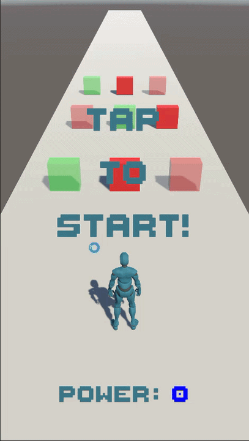

# 🏃 Lane Switch - Playable Ad


Интерактивный рекламный креатив в жанре 3D-раннера. Проект собран под WebGL и опубликован на itch.io.

**[▶ Играть](https://sweetjs64.itch.io/running-sweetjs)**

---

## 🎬 Геймплей в действии

|  |  |  |

---

## 🎮 Геймплей

Персонаж бежит по трём линиям в течение заданного времени. На пути спавнятся ряды из трёх препятствий - в каждом ряду ровно один объект каждого типа:

| Объект | Цвет | Эффект |
|---|---|---|
| Бафф | Зелёный | +10 к силе |
| Дебафф | Красный прозрачный | -10 к силе |
| Препятствие | Красный непрозрачный | Мгновенная смерть |

По истечении таймера появляется босс. Если накопленная сила >= HP босса - победа, иначе - поражение. Исход боя сопровождается анимациями: атака, смерть, танец победителя.

---

## 🏗️ Архитектура

```
Assets/Scripts/
├── Core/        - GameManager (singleton), ObjectPool, PooledObject, GameState
├── Player/      - PlayerLaneController, PlayerBossFight, PlayerAnimationController
├── Boss/        - BossAnimationController, BossHealthText, BossTargetPos
├── GamePlay/    - Spawner, MoveToPlayer
└── Utility/     - InputHelper, Tags
Assets/Configs/  - MovementConfigSO (ScriptableObject)
```

`GameState` - конечный автомат с шестью состояниями: `WaitingForTap → Running → Finishing → BossFight → Win / Lose`. Каждая система проверяет текущее состояние и реагирует только на своё.

---

## ⚙️ Стек

| | |
|---|---|
| Движок | Unity 2022.3.13f1 |
| Платформа | WebGL |
| UI | Unity UI Canvas + TextMeshPro |
| Данные | ScriptableObject (MovementConfigSO) |
| Паттерны | Object Pool, State Machine, Template Method |

---

## 💡 Что показывает проект

- **Playable Ad-структура** - кнопка Install, минимальный онбординг (Tap to Start), чёткий win/lose экран - стандартная анатомия рекламного креатива; кнопка Install ведёт на демо-заглушку
- **Object Pool** - без внешних зависимостей; ряды препятствий переиспользуются без аллокаций в рантайме
- **Гарантированный баланс строк** - в каждом ряду всегда ровно один бафф, один дебафф и одно препятствие, каждый раз на разных линиях; алгоритм исключает повторение позиции баффа два раза подряд
- **Единый InputHelper** - одна точка входа для Touch и Mouse, тап потребляется один раз за кадр и не дублируется между несколькими слушателями
- **Анимационная синхронизация** - `AnimationControllerBase.PlayAndWait()` ждёт реальную длину клипа через `GetCurrentAnimatorStateInfo`, колбэк срабатывает точно по завершении
- **Плавная смена полос** - Lerp позиции + наклон персонажа через `LerpAngle` при переходе, визуальный отклик на направление движения
- **Анимация UI** - пульсация текста реализована отдельным animation clip, не кодом

---

## 🧠 Решения и выводы

**Почему самописный пул без внешних библиотек?**
Playable Ad - это изолированная сцена с жёсткими ограничениями на размер билда и время загрузки. Любая внешняя зависимость увеличивает и то, и другое. `ObjectPool` на 50 строк решает задачу без лишнего веса.

**Почему ScriptableObject для конфига движения?**
`MoveSpeed`, `LaneOffset`, `DespawnZ` используются одновременно в `Spawner`, `MoveToPlayer` и `PlayerLaneController`. ScriptableObject - единый источник истины: изменил в одном месте, применилось везде. Без него пришлось бы синхронизировать три независимых поля вручную.

**Почему InputHelper потребляет тап один раз за кадр?**
`PlayerLaneController` и `GameManager` оба читают ввод в `Update()`. Без буфера первый тап при старте игры одновременно запускал бы бег и сдвигал персонажа на соседнюю полосу. `_consumedFrame` гарантирует, что один физический тап читается одинаково всеми слушателями в одном кадре.

---

## 🚀 Как запустить

1. Клонировать репозиторий
2. Открыть в **Unity 2022.3.13f1**
3. Открыть сцену `Assets/Scenes/GameScene.unity`
4. Нажать Play

> Внешних зависимостей нет - всё включено в проект.
